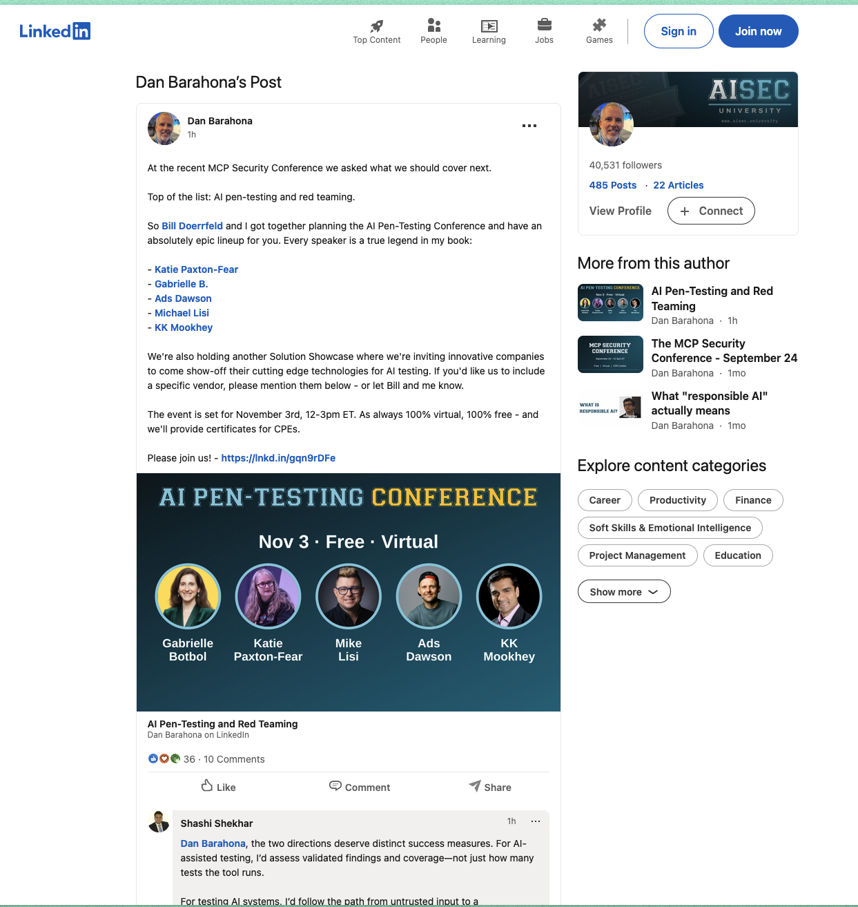
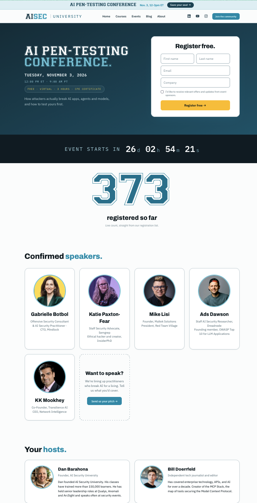

# [AI Pen-Testing Conference](https://aisec.university/conferences/ai-pen-testing-red-teaming-conference)
## [AI Security University (AISecU)](https://aisec.university/)

```
    _______________________________________________
   |                                               |
   |  > ACCESS GRANTED                             |
   |  > LOADING AI PEN-TESTING PANEL...            |
   |  > SPEAKERS: 5 CONFIRMED                      |
   |  > REGISTERED: 375+                           |
   |  > FORMAT: VIRTUAL // FREE // CPE             |
   |  > ETA: November 3, 2026 // 12-3PM ET        |
   |_______________________________________________|
          \   ^__^
           \  (oo)\_______
              (__)\       )\/\
                  ||----w |
                  ||     ||
```

## `// STATUS`

- **Event:** AI Pen-Testing Conference
  - **Organizers:** Dan Barahona (AI Security University), Bill Doerrfeld
  - **Type:** Panel — AI Red Teaming (12:15 PM - 1:00 PM ET)
  - **Panelists:** Mike Lisi, Ads Dawson, KK Mookhey (moderated by Bill Doerrfeld)
  - **Location:** Virtual (Free)
  - **Date:** Tuesday, November 3, 2026
  - **Time:** 12:00 PM - 3:00 PM ET (9:00 AM - 12:00 PM PT)
  - **Duration:** 3 hours (panel segment: 45 mins)
  - **CPE Certificate:** Included
  - **Topic:** How attackers actually break AI apps, agents and models, and how to test yours first

## Schedule

| Time (ET) | Session |
|-----------|---------|
| 12:00 - 12:15 | Welcome and Introductions |
| 12:15 - 1:00 | **Panel: AI Red Teaming** (Lisi, Dawson, Mookhey; moderated by Doerrfeld) |
| 1:00 - 2:00 | Vendor Showcase (10 minutes each) |
| 2:00 - 2:30 | Talk by Gabrielle Botbol |
| 2:30 - 3:00 | Talk by Katie Paxton-Fear |

## All Speakers

- **Gabrielle Botbol** — Offensive Security Consultant & AI Security Practitioner; CTO at Mindlock
- **Katie Paxton-Fear** — Staff Security Advocate at Semgrep; ethical hacker and InsiderPhD creator
- **Mike Lisi** — Founder, Maltek Solutions; President, Red Team Village
- **Ads Dawson** — Staff AI Security Researcher at Dreadnode; Founding member, OWASP Top 10 for LLM Applications
- **KK Mookhey** — Co-Founder, Transilience AI; CEO, Network Intelligence





- **Official links:**
  - [AI Pen-Testing Conference](https://aisec.university/conferences/ai-pen-testing-red-teaming-conference)
  - [LinkedIn Announcement](https://www.linkedin.com/posts/rdbarahona_at-the-recent-mcp-security-conference-we-ugcPost-7513941339714035712-G6zT/)

- **Local archives:**
  - [Event page capture](<AI Pen-Testing Conference — AI Security University (2026-10-08 10：05：56 a.m.).html>)

----------------------------------------
