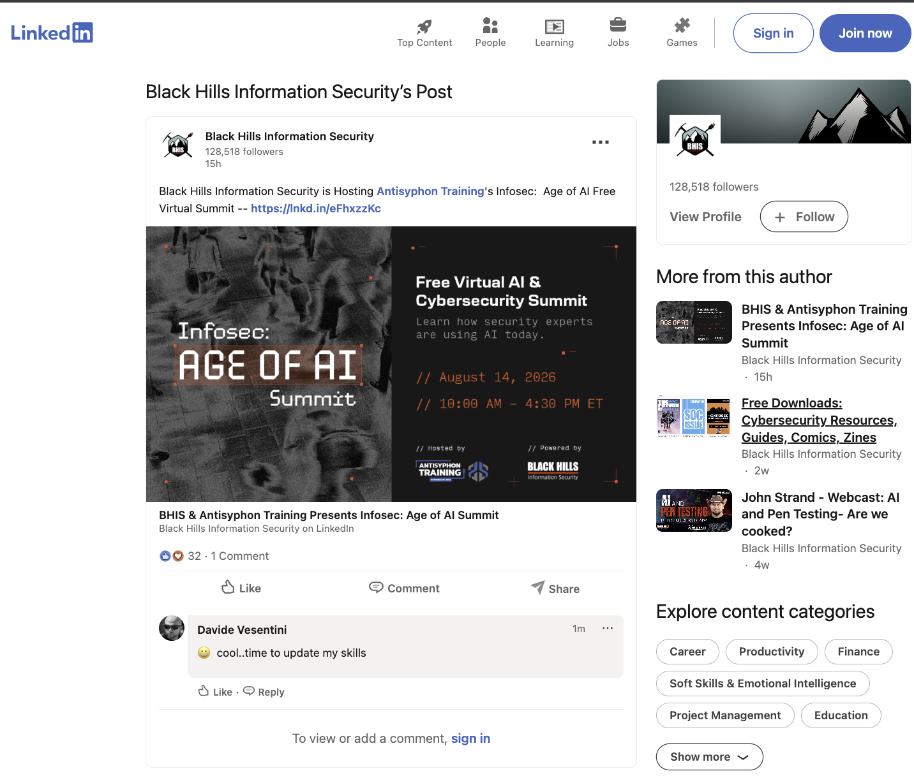
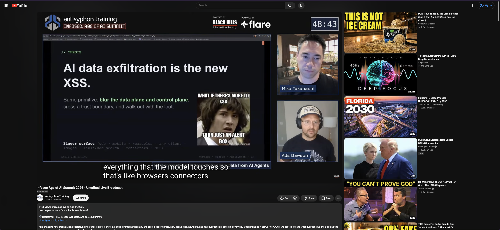

# [AI Cybersecurity Summit 2026](https://learning.antisyphontraining.com/pages/ai-cybersecurity-summit)
## [Summit Keynote: Exfil Everything: A Year of Stealing Data from AI Agents](https://learning.antisyphontraining.com/pages/summit-keynote-exfil-everything-a-year-of-stealing-data-from-ai-agents)

- **Event:** AI Cybersecurity Summit 2026
- **Organizer:** Antisyphon Training
- **Talk title:** "Exfil Everything: A Year of Stealing Data from AI Agents"
- **Speakers:** Ads Dawson and Mike Takahashi
- **Date:** Friday, August 14, 2026
- **Time:** 10:00 AM - 10:50 AM ET
- **Format:** Virtual summit keynote

### About

This keynote covers a year of stealing data from AI agents: what worked, what failed, and what the security community should take away from offensive testing against agentic systems.

### LinkedIn Event

- **LinkedIn event post:** [BHIS & Antisyphon Training Presents Infosec: Age of AI Summit](https://www.linkedin.com/posts/black-hills-information-security-is-hosting-ugcPost-7493038650297966592-tiVQ/?utm_source=share&utm_medium=member_android&rcm=ACoAAA1p028B5AHnJgHCbLKDdcDTNnvyDWkUwzE)
- **Local LinkedIn page archive:** [linkedin-event-bhis-antisyphon-ai-summit.html](linkedin-event-bhis-antisyphon-ai-summit.html)

### Live Recording

- **YouTube live recording:** [Infosec Age of AI Summit 2026 - Unedited Live Broadcast](https://www.youtube.com/live/66xD4K6eeB0)
- **Local YouTube page archive:** [youtube-live-broadcast-infosec-age-of-ai-summit-2026.html](youtube-live-broadcast-infosec-age-of-ai-summit-2026.html)

### Materials

- **Slides:** [Exfil Everything: A Year of Stealing Data from AI Agents](<[EXTERNAL] AntiSyphon INFOSEC_ AGE OF AI SUMMIT - Exfil Everything_ A Year of Stealing Data from AI Agents - Ads n Tak.pdf>)
- **Promo video:** [YouTube](https://www.youtube.com/watch?v=oi9PMp4OkLU)
- **Local keynote page PDF archive:** [Exfil Everything: Stealing Data From AI Agents](exfil-everything-stealing-data-from-ai-agents.pdf)
- **Local summit page archive:** [ai-cybersecurity-summit-2026-page.html](ai-cybersecurity-summit-2026-page.html)

### Links

- **Summit page:** [AI Cybersecurity Summit 2026](https://learning.antisyphontraining.com/pages/ai-cybersecurity-summit)
- **Keynote page:** [Summit Keynote: Exfil Everything: A Year of Stealing Data from AI Agents](https://learning.antisyphontraining.com/pages/summit-keynote-exfil-everything-a-year-of-stealing-data-from-ai-agents)
- **LinkedIn event post:** [BHIS & Antisyphon Training Presents Infosec: Age of AI Summit](https://www.linkedin.com/posts/black-hills-information-security-is-hosting-ugcPost-7493038650297966592-tiVQ/?utm_source=share&utm_medium=member_android&rcm=ACoAAA1p028B5AHnJgHCbLKDdcDTNnvyDWkUwzE)
- **YouTube live recording:** [Infosec Age of AI Summit 2026 - Unedited Live Broadcast](https://www.youtube.com/live/66xD4K6eeB0)
- **Promo video:** [YouTube](https://www.youtube.com/watch?v=oi9PMp4OkLU)
- **Local keynote page archive:** [summit-keynote-exfil-everything-a-year-of-stealing-data-from-ai-agents.html](summit-keynote-exfil-everything-a-year-of-stealing-data-from-ai-agents.html)

> **Status:** Delivered. Slides, LinkedIn event capture, local summit page capture, keynote page capture, keynote page PDF, keynote graphic, YouTube live recording, and YouTube page archive saved.
