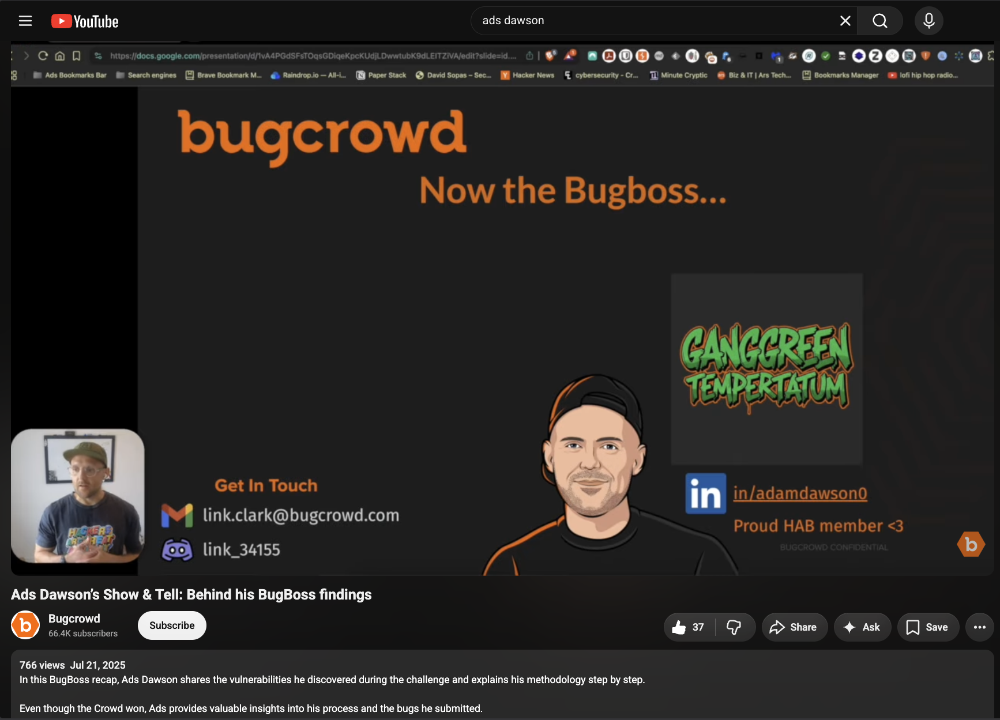

# [BugCrowd Bugboss v3 Show and Tell]()
## [Ads Dawson’s Show & Tell: Behind his BugBoss findings](https://youtu.be/zlodGMqAuD8?feature=shared)

- **Talk title:** "BugCrowd Bugboss v3 Show and Tell"
  - **Abstract:** _Join APIsec University as Ads Dawson, v1.1 Technical Release Lead, Core Founding Member & Entry Lead for the OWASP Top 10 for Large Language Model Applications and a seasoned security engineer at Cohere takes us on an insightful journey through the challenges and solutions involved in securing large language models and natural language programming APIs. With his extensive experience, Ads will shed light on how to avoid data breaches, fortify against attacks, and enhance the security of these crucial technologies. Don’t miss this opportunity to learn from a true expert in API security!_

- 📄 **Slides (PDF):** [BugBoss Show n Tell - July 2025](Ads%20Dawson%20-%20BugCrowd%20-%20BugBoss%20Show%20n%20Tell%20-%20July%202025.pdf)
- 🍿 **YouTube Recording** [Ads Dawson’s Show & Tell: Behind his BugBoss findings](https://youtu.be/zlodGMqAuD8?feature=shared)
- 🗂️ **YouTube HTML archive:** [Ads Dawson’s Show & Tell: Behind his BugBoss findings](ads-dawson-bugboss-show-and-tell-youtube.html)
- 📄 **YouTube PDF archive:** [Ads Dawson’s Show & Tell: Behind his BugBoss findings](ads-dawson-bugboss-show-and-tell-youtube.pdf)
- 📣 **Speaker card:** [Hacker Spotlight: Ads Dawson](https://www.bugcrowd.com/blog/hacker-spotlight-ads-dawson/)
- 🗣️ **Social links:** [Here](tbc) | [Here](tbc)

------------------------------
