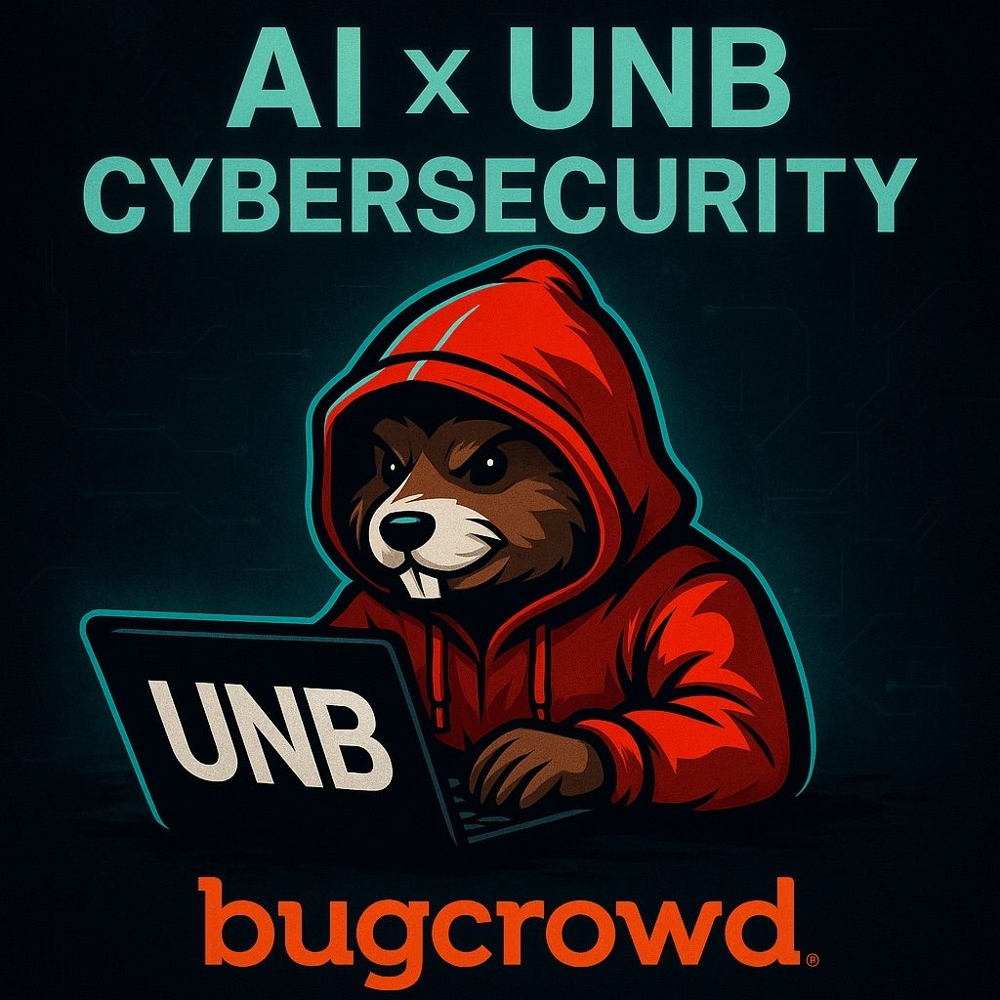

# [University of New Brunswick (UNB)](https://www.unb.ca/)
## BugCrowd College Program Educational Event

- **Institution:** University of New Brunswick (UNB)
- **Program:** BugCrowd College Program
- **Session Type:** Educational Event
- **Duration:** TBC
- **Format:** TBC
- **Date and Time:** November 2025 (Date TBC)

### Speaker Bio

> Ads is a web application pentester, seasoned bug bounty hunter, and BugCrowd Hacker Advisory Board Member with over 15 years of offensive security experience. As co-author of "AI Native LLM Security" and Board member of the OWASP Top 10 for LLM Applications project, he brings deep expertise in AI security to educational settings. He actively mentors students and early-career professionals entering the cybersecurity field.

---

- 📄 **Slides (PDF):** [TBC]()
- 📣 **Speaker card:** [Hacker Spotlight: Ads Dawson](https://www.bugcrowd.com/blog/hacker-spotlight-ads-dawson/)
- 🗞️ **Social Post**: [Here](https://www.linkedin.com/posts/unbcybersec_bugcrowd-unb-cybersecurity-activity-7388926821540548608-ZokB?utm_source=share&utm_medium=member_android&rcm=ACoAAA1p028B5AHnJgHCbLKDdcDTNnvyDWkUwzE)
- 🍿 **YouTube Recording** [TBC](TBC)
