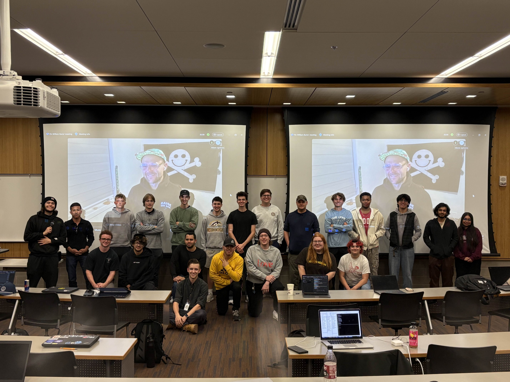
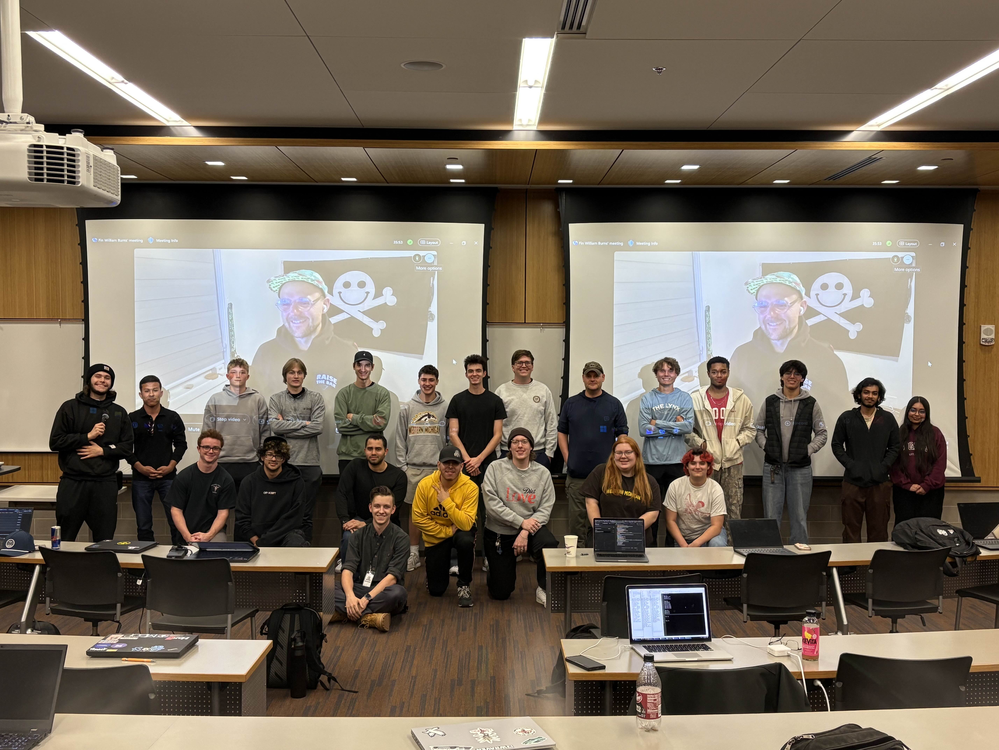

# [WRAVEN WMU Cybersecurity](https://wraven.org/)
## BugCrowd College Program Educational Event

- **Institution:** WRAVEN
- **Program:** BugCrowd College Program
- **Event:** Remote online talk: A Bug Hunter's Journey from CTFs to Cash
- **Session Type:** Internal Educational Event
- **Duration:** 60 minutes
- **Format:** Technical demonstration and practical workshop
- **Date and Time:** Oct 22 - 18:00-20:00pm ET

### About the Event

Join us for an exclusive symposium to learn results of the EdProtect security research event and network with researchers and edtech leaders. This symposium brings together cybersecurity experts, educational technology professionals, and researchers to discuss the latest security challenges and solutions in the edtech space.

### Event Photos

- 📄 **Slides (PDF):** [Here](https://github.com/GangGreenTemperTatum/speaking/blob/main/docs/conferences/bugcrowd/2025/october/wraven/A%20Bug%20Hunter's%20Journey%20from%20CTFs%20to%20Cash%20-%20Ads%20Dawson%20-%20WRAVEN%20WMU%20Cybersecurity%20(Michigan%20University)%20%20-%20October%2020%202025.pdf)
- 📣 **Speaker card:** [Hacker Spotlight: Ads Dawson](https://www.bugcrowd.com/blog/hacker-spotlight-ads-dawson/)
- 🗣️ **Social links:** [Here](https://www.linkedin.com/posts/wravenproject_bugbounty-cybersecurity-wraven-activity-7387145323242184705-1iEx?utm_source=share&utm_medium=member_android&rcm=ACoAAA1p028B5AHnJgHCbLKDdcDTNnvyDWkUwzE) | [LinkedIn | WRAVEN x BugCrowd](https://www.linkedin.com/posts/activity-7372342320895045632-QXcA/)