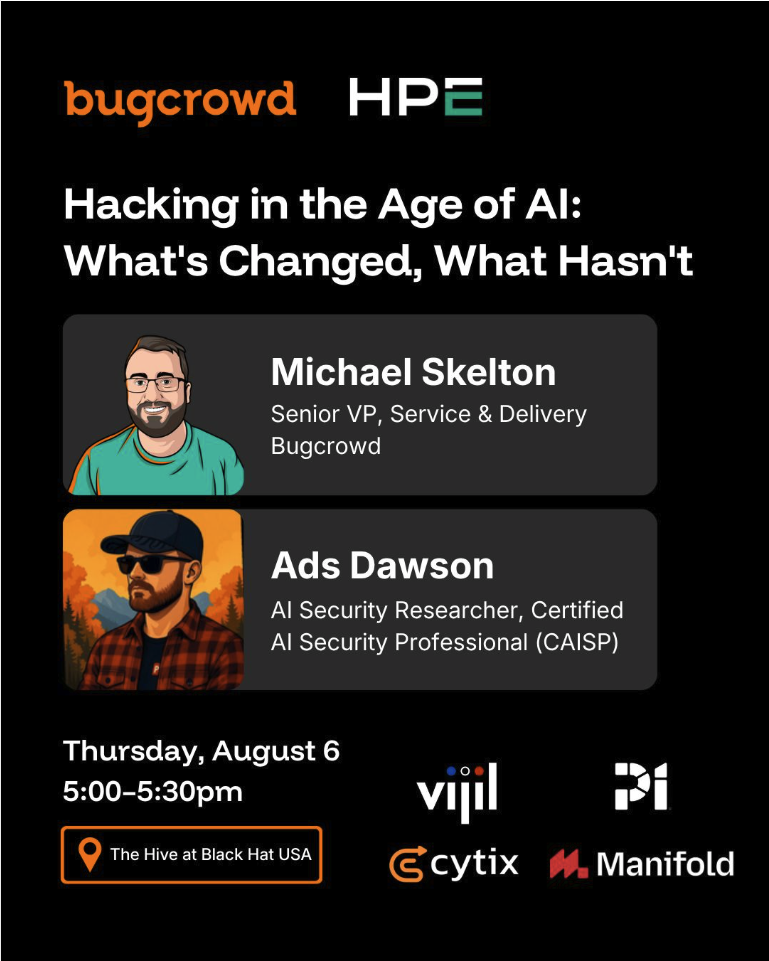
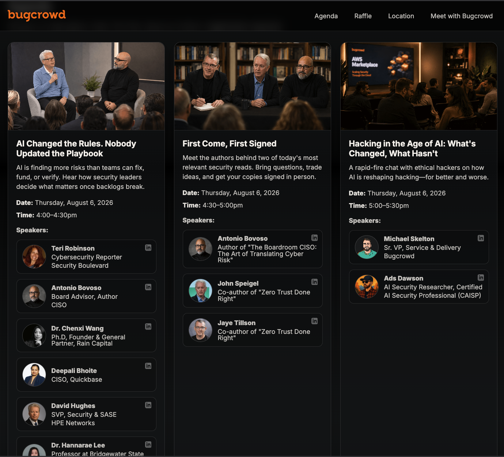

# [The Hive at Black Hat USA](https://www.bugcrowd.com/the-hive/)
## [Hacking in the Age of AI: What's Changed, What Hasn't](https://www.bugcrowd.com/the-hive/#agenda)

- **Organizer:** Bugcrowd
- **Event:** The Hive at Black Hat USA
- **Session title:** "Hacking in the Age of AI: What's Changed, What Hasn't"
- **Description:** A rapid-fire chat with ethical hackers on how AI is reshaping hacking, for better and worse.
- **Date:** Thursday, August 6, 2026
- **Time:** 5:00-5:30 PM
- **Format:** Rapid-fire chat
- **Venue:** Black Hat USA / The Hive

### Links

- **Agenda page:** [The Hive Agenda](https://www.bugcrowd.com/the-hive/#agenda)
- **Event page:** [The Hive at Black Hat USA](https://www.bugcrowd.com/the-hive/)
- **Social post:** [LinkedIn](https://www.linkedin.com/posts/lets-talk-about-the-tsunami-of-automated-share-7483651169480015872-v3Zo/?utm_source=share&utm_medium=member_android&rcm=ACoAAA1p028B5AHnJgHCbLKDdcDTNnvyDWkUwzE)
- **Local page archive:** [The Hive at Black Hat USA | Bugcrowd (7_17_2026 4:56:05 PM).html](<The Hive at Black Hat USA ｜ Bugcrowd (7_17_2026 4：56：05 PM).html>)
- **Local PDF archive:** [The Hive at Black Hat USA _ Bugcrowd.pdf](<The Hive at Black Hat USA _ Bugcrowd.pdf>)

> **Status:** Schedule confirmed. Local HTML and PDF archives saved.
