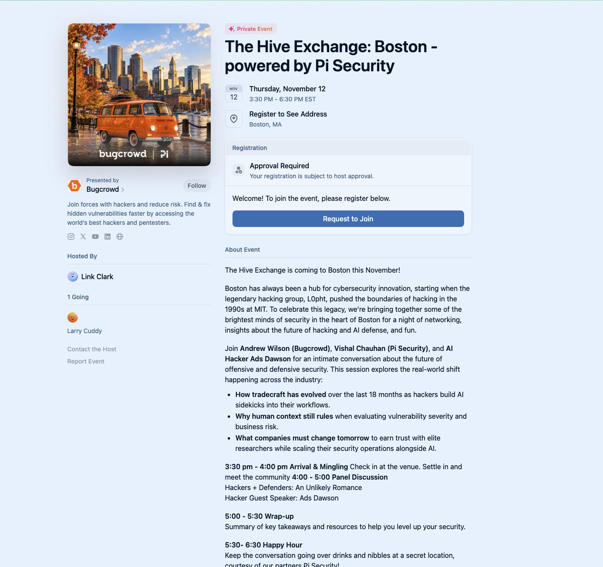

# [The Hive Exchange: Boston](https://lu.ma/70dspecp)
## [Hackers + Defenders: An Unlikely Romance](https://lu.ma/70dspecp)

- **Organizer:** Bugcrowd
- **Event:** The Hive Exchange: Boston - powered by Pi Security
- **Panel title:** "Hackers + Defenders: An Unlikely Romance"
- **Description:** A networking event celebrating Boston's cybersecurity legacy, exploring how tradecraft has evolved with AI integration and discussing defensive security practices.
- **Date:** Thursday, November 12, 2026
- **Time:** 3:30 PM - 6:30 PM ET
- **Format:** Panel Discussion + Happy Hour
- **Location:** Boston, MA
- **Host:** Link Clark

### Schedule

- 3:30-4:00 PM: Arrival & Mingling
- 4:00-5:00 PM: Panel Discussion
- 5:00-5:30 PM: Wrap-up
- 5:30-6:30 PM: Happy Hour

### Panelists

- **Andrew Wilson** (Bugcrowd)
- **Vishal Chauhan** (Pi Security)
- **Ads Dawson** (AI Hacker / Guest Speaker)

### Links

- **Event page:** [The Hive Exchange: Boston on Luma](https://lu.ma/70dspecp)
- **Local page archive:** [The Hive Exchange: Boston - powered by Pi Security · Luma (2026-10-09 5:20:46 a.m.).html](<The Hive Exchange： Boston - powered by Pi Security · Luma (2026-10-09 5：20：46 a.m.).html>)

> **Status:** Schedule confirmed. Local HTML archive and screenshot saved.
