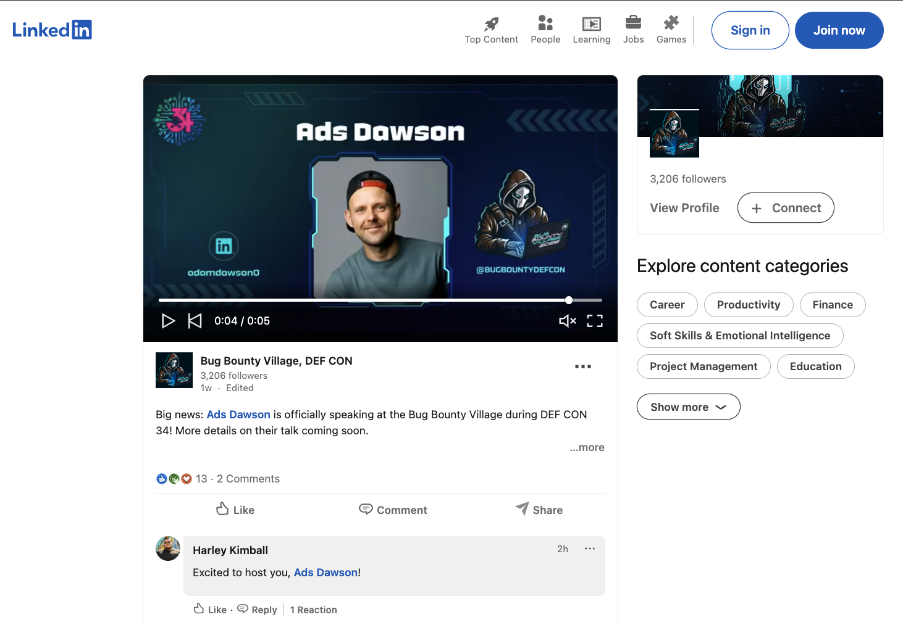
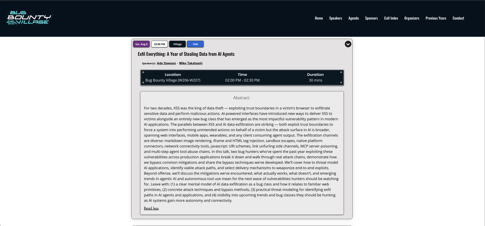
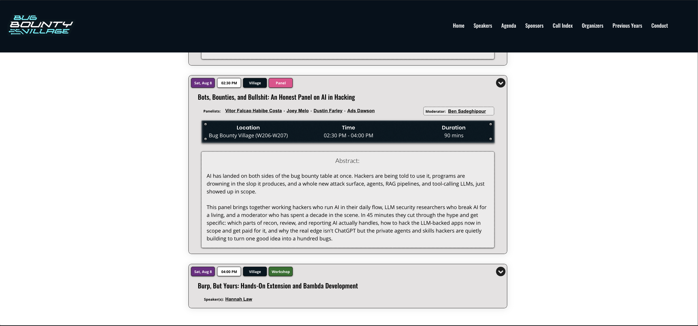

# [Exfil Everything: A Year of Stealing Data from AI Agents](https://www.bugbountydefcon.com/speakers-2026)
## [Bug Bounty Village - DEF CON 34](https://www.bugbountydefcon.com/agenda-2026)




```
    _______________________________________________
   |                                               |
   |  > ACCESS GRANTED                             |
   |  > LOADING PAYLOAD...                         |
   |  > EXFILTRATING SECRETS...                    |
   |  > ██████████████████████████░░░░  82%        |
   |  > ANOMALY DETECTED: TALK NOT YET DEPLOYED    |
   |  > ETA: DEF CON 34 // August 2026             |
   |_______________________________________________|
          \   ^__^
           \  (oo)\_______
              (__)\       )\/\
                  ||----w |
                  ||     ||
```

## `// COMING SOON`

- **Talk title:** "Exfil Everything: A Year of Stealing Data from AI Agents"
  - **Type:** Individual Talk (30 Minutes)
  - **Speakers:** Ads Dawson, Mike Takahashi
  - **Village:** Bug Bounty Village
  - **Location:** Bug Bounty Village (W206-W207)
  - **Date:** Saturday, August 8, 2026
  - **Time:** 2:00 PM - 2:30 PM
  - **Duration:** 30 mins
  - **Abstract:** _`[REDACTED UNTIL SHOWTIME]` -- What happens when you spend a year finding creative ways to steal data from AI agents? You get a talk at DEF CON. Details dropping August 2026._
  - **Social Post**: [Here](https://www.linkedin.com/posts/bugbounty-defcon-bbv-ugcPost-7480999746346569729-ULiu/?utm_source=share&utm_medium=member_android&rcm=ACoAAA1p028B5AHnJgHCbLKDdcDTNnvyDWkUwzE)



- **Panel title:** "Bots, Bounties, and Bullshit: An Honest Panel on AI in Hacking"
  - **Type:** Panel
  - **Village:** Bug Bounty Village
  - **Location:** Bug Bounty Village (W206-W207)
  - **Date:** Saturday, August 8, 2026
  - **Time:** 2:30 PM - 4:00 PM
  - **Duration:** 90 mins
  - **Moderator:** Ben Sadeghipour
  - **Panelists:** Vitor Falcao Halabe Costa, Joey Melo, Dustin Farley, Ads Dawson
  - **Abstract:** _`[DETAILS TBC]` -- Another DEF CON 2026 Bug Bounty Village appearance, with details forthcoming. Placeholder for now; expected to be similar in status and format to the Exfil Everything talk._



- **Official agenda:** [Bug Bounty Village Agenda 2026](https://www.bugbountydefcon.com/agenda-2026)
- **Official speaker listing:** [Bug Bounty Village Speakers 2026](https://www.bugbountydefcon.com/speakers-2026)
- **Local agenda page archive:** [Agenda ｜ Bug Bounty Village (7_22_2026 12：18：56 PM).html](<Agenda ｜ Bug Bounty Village (7_22_2026 12：18：56 PM).html>)
- **Local agenda PDF archive:** [Agenda _ Bug Bounty Village.pdf](<Agenda _ Bug Bounty Village.pdf>)
- **Local speakers page archive:** [defcon34-bbv-speakers-2026-page.html](defcon34-bbv-speakers-2026-page.html)
- **Local speakers PDF archive:** [defcon34-bbv-speakers-2026-page.pdf](defcon34-bbv-speakers-2026-page.pdf)

```
 ______________________________________
/ This README will self-destruct and   \
| be replaced with actual content      |
\ after the talk. Maybe.              /
 --------------------------------------
        \   ^__^
         \  (xx)\_______
            (__)\       )\/\
             U  ||----w |
                ||     ||
```

---

> **Status:** CFP accepted. Schedule confirmed. Secrets being exfiltrated.

------------------------------
