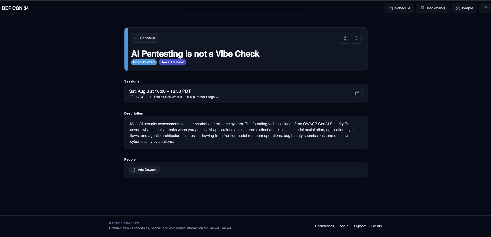

# [AI Pentesting is not a Vibe Check](https://hackertracker.app/defcon34/content/66938)
## [OWASP Village - DEF CON 34](https://hackertracker.app/defcon34/content/66938)



```
    _______________________________________________
   |                                               |
   |  > ACCESS GRANTED                             |
   |  > LOADING PAYLOAD...                         |
   |  > TESTING AI SECURITY...                     |
   |  > ██████████████████████████░░░░  82%        |
   |  > ANOMALY DETECTED: TALK NOT YET DEPLOYED    |
   |  > ETA: DEF CON 34 // August 2026             |
   |_______________________________________________|
          \   ^__^
           \  (oo)\_______
              (__)\       )\/\
                  ||----w |
                  ||     ||
```

## `// COMING SOON`

- **Talk title:** "AI Pentesting is not a Vibe Check"
  - **Type:** Creator Talk/Panel
  - **Speaker:** Ads Dawson
  - **Village:** OWASP Foundation
  - **Location:** LVCC - L1 - Exhibit Hall West 3 - 1100 (Creator Stage 7)
  - **Date:** Saturday, August 8, 2026
  - **Time:** 4:00 PM - 4:30 PM PDT
  - **Duration:** 30 mins
  - **Abstract:** Most AI security assessments test the chatbot and miss the system. The founding technical lead of the OWASP GenAI Security Project covers what actually breaks when you pentest AI applications across three distinct attack tiers — model exploitation, application-layer flaws, and agentic architecture failures — drawing from frontier model red team operations, bug bounty submissions, and offensive cybersecurity evaluations.

- **HackerTracker listing:** [AI Pentesting is not a Vibe Check](https://hackertracker.app/defcon34/content/66938)

```
 ______________________________________
/ This README will self-destruct and   \
| be replaced with actual content      |
\ after the talk. Maybe.              /
 --------------------------------------
        \   ^__^
         \  (xx)\_______
            (__)\       )\/\
             U  ||----w |
                ||     ||
```

---

> **Status:** Schedule confirmed. Vibes unchecked.

------------------------------
