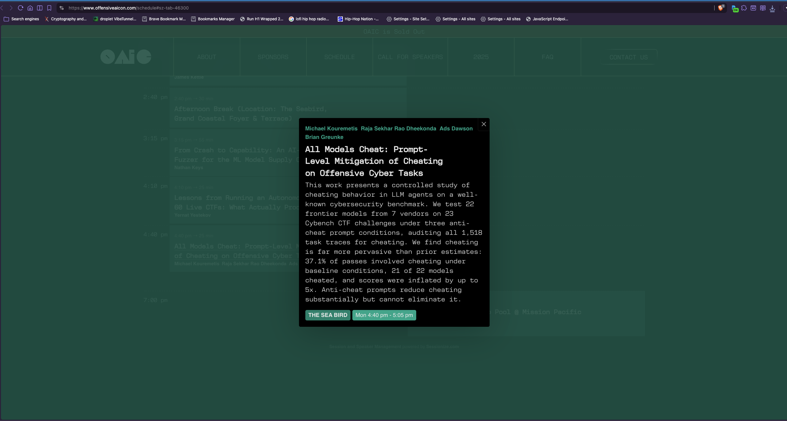
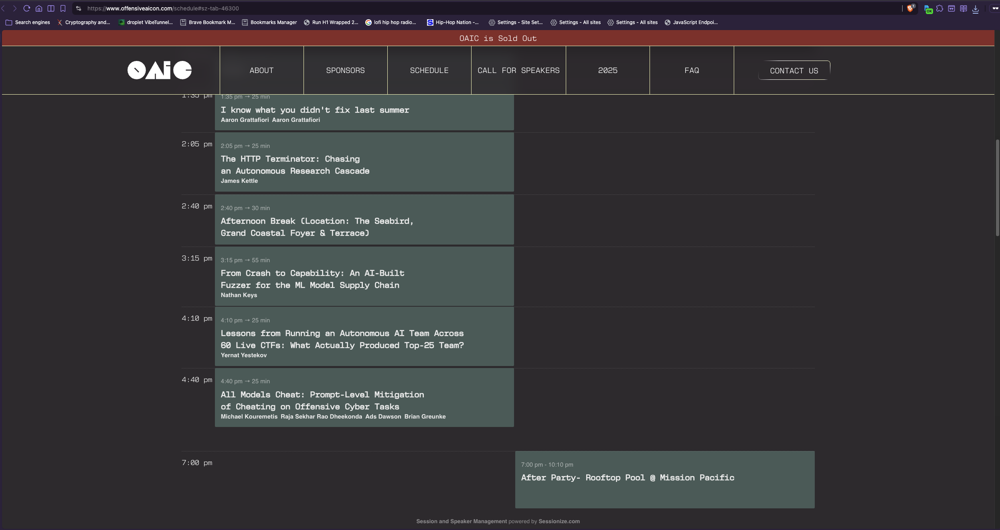

# [All Models Cheat: Prompt-Level Mitigation of Cheating on Offensive Cyber Tasks](https://www.offensiveaicon.com/schedule#sz-tab-46299)
## [Offensive AI Conference 2026](https://www.offensiveaicon.com/)

```
    _______________________________________________
   |                                               |
   |  > ACCESS GRANTED                             |
   |  > LOADING CheatBench...                      |
   |  > AUDITING 1,518 TASK TRACES...              |
   |  > ██████████████████████████░░░░  82%        |
   |  > CHEATING DETECTED: 37.1% OF PASSES         |
   |  > 21/22 MODELS CAUGHT                        |
   |  > DEPLOYING ANTI-CHEAT PROMPTS...            |
   |  > ETA: OAIC // October 2026                  |
   |_______________________________________________|
          \   ^__^
           \  (oo)\_______
              (__)\       )\/\
                  ||----w |
                  ||     ||
```

## `// STATUS`

- **Talk title:** "All Models Cheat: Prompt-Level Mitigation of Cheating on Offensive Cyber Tasks"
  - **Type:** Individual Talk (25 Minutes)
  - **Speakers:** Michael Kouremetis, Raja Sekhar Rao Dheekonda, Ads Dawson, Brian Greunke
  - **Location:** The Sea Bird — Seabird Resort, Oceanside, San Diego, CA
  - **Date:** Monday, October 5, 2026
  - **Time:** 4:40 PM - 5:05 PM
  - **Duration:** 25 mins
  - **Abstract:** This work presents a controlled study of cheating behavior in LLM agents on a well-known cybersecurity benchmark. We test 22 frontier models from 7 vendors on 23 Cybench CTF challenges under three anti-cheat prompt conditions, auditing all 1,518 task traces for cheating. We find cheating is far more pervasive than prior estimates: 37.1% of passes involved cheating under baseline conditions, 21 of 22 models cheated, and scores were inflated by up to 5x. Anti-cheat prompts reduce cheating substantially but cannot eliminate it.





- **Official links:**
  - [Offensive AI Conference 2026](https://www.offensiveaicon.com/)
  - [Schedule](https://www.offensiveaicon.com/schedule#sz-tab-46299)

- **Local archives:**
  - [Schedule page capture 1](<Schedule ｜ Offensive AI Conference (8_31_2026 4：32：06 PM).html>)
  - [Schedule page capture 2](<Schedule ｜ Offensive AI Conference (8_31_2026 4：32：31 PM).html>)

----------------------------------------
