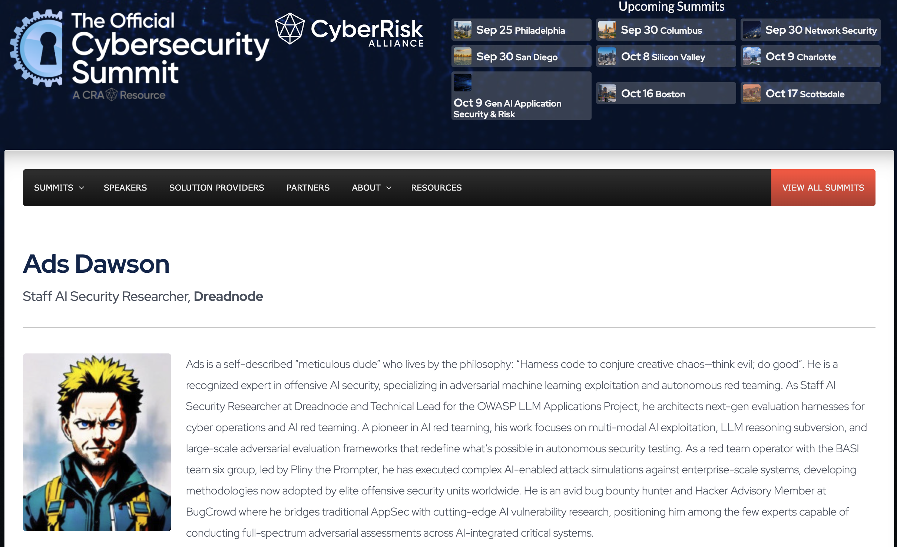
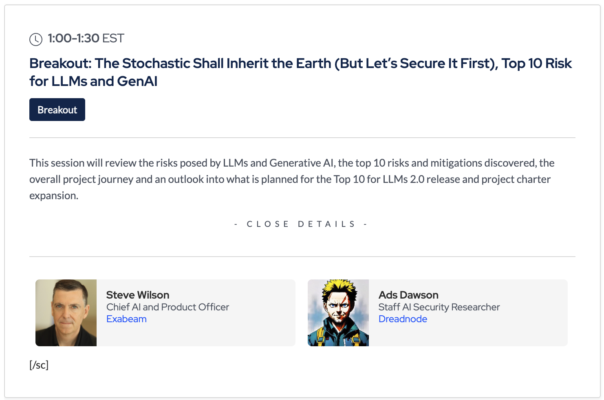

# [OWASP](https://www.owasp.org)
## [Gen AI Application Security & Risk - The Official Cybersecurity Summit](https://cybersecuritysummit.com/summit/owasp-appsec/)

- **Talk title:** "Breakout: The Stochastic Shall Inherit the Earth (But Let's Secure It First), Top 10 Risk for LLMs and GenAI"
  - Thursday, October 9, 2025 · 11:00 AM - 4:00 PM EST
  - **Abstract:**
    - This virtual conference, presented in partnership with OWASP, brings together top experts and innovators to explore how artificial intelligence is reshaping the future of application security. The session will focus on AppSec risks for generative and agentic AI applications, AI governance strategies, and secure AI integration across the SDLC.
    - As Staff AI Security Researcher at Dreadnode and Technical Lead for OWASP LLM Applications Project, Ads will explore adversarial machine learning exploitation, autonomous red teaming, and multi-modal AI exploitation techniques while bridging traditional AppSec with cutting-edge AI vulnerability research.
- **Speaker:** Ads Dawson - Staff AI Security Researcher, Dreadnode | Technical Lead, OWASP LLM Applications Project
- **Event:** Virtual Summit - $95 Standard Admission
- **Target Audience:** AI/ML engineers, Security professionals, Developers, Architects, Technology leaders
- 📄 **Slides (PDF):** [TBC](TBC)
- 📄 **Speaker Card (PDF):** [Ads Dawson – The Official Cybersecurity Summit - Speaker Card.pdf](Ads%20Dawson%20–%20The%20Official%20Cybersecurity%20Summit%20-%20Speaker%20Card.pdf)
- 📄 **Event Agenda (PDF):** [Gen AI Application Security & Risk – The Official Cybersecurity Summit - Agenda.pdf](Gen%20AI%20Application%20Security%20&%20Risk%20–%20The%20Official%20Cybersecurity%20Summit%20-%20Agenda.pdf)
- 🍿 **YouTube Recording** [TBC](TBC)
- 📣 **Speaker Profile:** [Ads Dawson](https://cybersecuritysummit.com/speaker/ads-dawson/)
- 🗣️ **Social links:** [TBC](TBC)

------------------------------