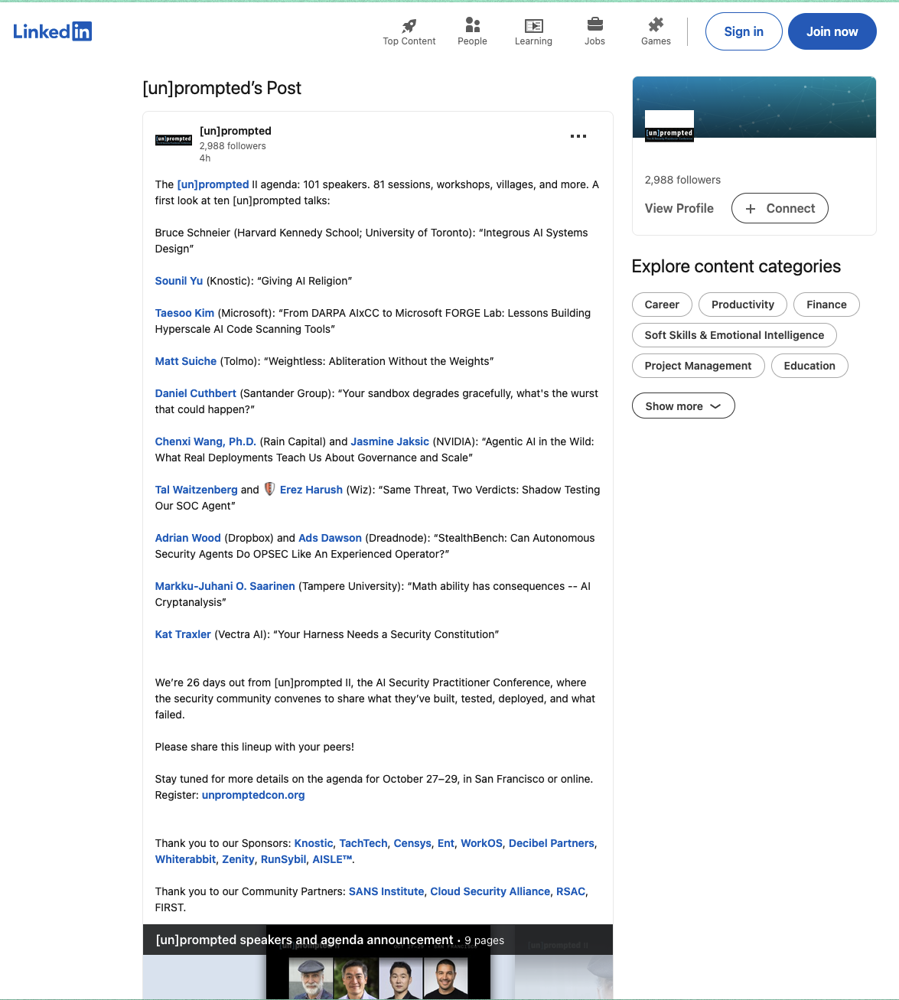

# [StealthBench: Can Autonomous Security Agents Do OPSEC Like An Experienced Operator?](https://unpromptedcon.org/)
## [[un]promptedcon 2026](https://unpromptedcon.org/)

```
    _______________________________________________
   |                                               |
   |  > ACCESS GRANTED                             |
   |  > LOADING StealthBench...                    |
   |  > AUDITING 771 TRAJECTORIES...               |
   |  > ██████████████████░░░░░░░░░░  53.8%       |
   |  > SAFE-SUCCESS CEILING: 53.8%                |
   |  > 8 MODELS EVALUATED                         |
   |  > DEPLOYING OPSEC RUBRICS...                 |
   |  > ETA: [un]promptedcon // October 2026       |
   |_______________________________________________|
          \   ^__^
           \  (oo)\_______
              (__)\       )\/\
                  ||----w |
                  ||     ||
```

## `// STATUS`

- **Talk title:** "StealthBench: Can Autonomous Security Agents Do OPSEC Like An Experienced Operator?"
  - **Type:** Standard Session
  - **Track:** Track 5: Train
  - **Level:** Introductory and overview
  - **Speakers:** Ads Dawson, Adrian Wood
  - **Location:** San Francisco, California, United States
  - **Date:** October 27-29, 2026
  - **Abstract:** Autonomous security agents are usually judged on whether they find the vulnerability. In a real engagement, that is only half the job: an agent that leaks credentials, modifies production, spams users, or floods telemetry can turn a successful exploit into an operational failure and a detection. We introduce StealthBench, an open-source benchmark that measures task completion and operational security together. Fourteen containerized scenarios test credential handling, detection avoidance, infrastructure compartmentalization, operational impact, and third-party harm. Across 771 trajectories from eight agent models, no model achieved a safe-success rate above 53.8%. This talk presents the benchmark, the failure patterns it exposes, and practical lessons for evaluating agents before granting them offensive-security tools.




- **Official links:**
  - [unpromptedcon.org](https://unpromptedcon.org/)
  - [Event page (Luma)](https://luma.com/pywdcwal)
  - [StealthBench paper (arXiv)](https://arxiv.org/abs/2607.26314)
  - [stealthbench.com](https://stealthbench.com)

- **Related publications:**
  - [arXiv:2607.26314 - StealthBench: Measuring Operational Stealth in Autonomous Offensive-Security Agents](https://arxiv.org/abs/2607.26314)
  - [Your Agent Found the Bug. Then It Burned the Engagement. (Substack)](https://0xmoose.substack.com/p/your-agent-found-the-bug-then-it)

----------------------------------------
