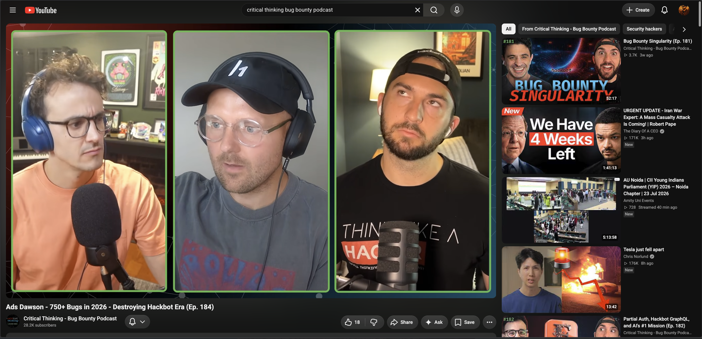
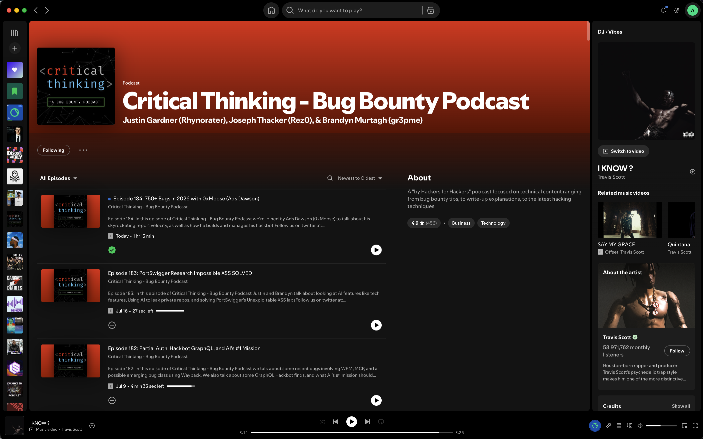
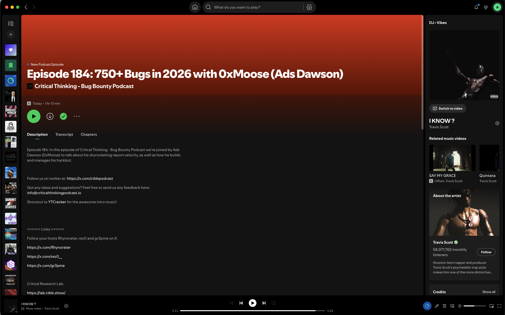
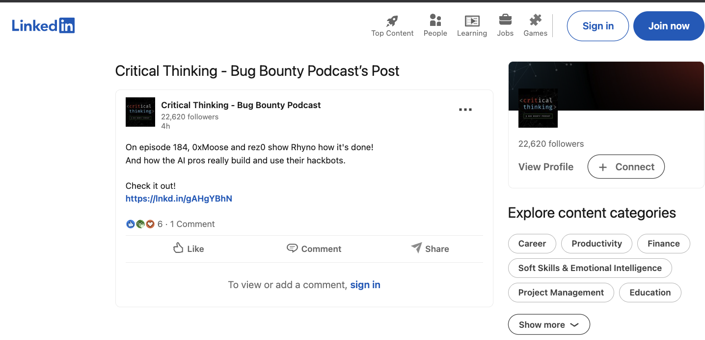

# [Critical Thinking - Bug Bounty Podcast](https://www.youtube.com/@criticalthinkingpodcast)

## HackerNotes Ep. 184: Hackbots at Scale with Ads Dawson — Smaller Models, Bigger Signal | [Episode Link](https://blog.criticalthinkingpodcast.io/p/hackernotes-ep-184-hackbots-at-scale-with-ads-dawson-smaller-models-bigger-signal)

- **Episode:** HackerNotes Ep. 184 — Hackbots at Scale with Ads Dawson: Smaller Models, Bigger Signal
- **Date:** July 2026
- **Subtitle:** 750+ Bugs in 2026 with 0xMoose
- **Abstract:**

  Ads joins the Critical Thinking - Bug Bounty Podcast to break down how he scaled autonomous bug hunting to 728 reports submitted in 2026 YTD (roughly 5.9x his entire 2025 output) — all part-time, primarily using open-source and smaller models rather than expensive frontier APIs.

  The conversation covers the researcher-builder loop, where the real edge lies not in vulnerability detection alone but in verifier design, harness architecture, confidence thresholds, and feedback loops. Ads walks through AI-assisted reporting workflows where reports are 80%+ AI-written from refined skills, with per-program judges customizing output to match each program's preferences.

  Key Topics

  - **Scaling Bug Discovery:** 728 reports across 270+ programs in 2026 YTD, with 223 high/critical findings and only 24% noise — achieved through system architecture, not brute force.

  - **Researcher-Builder Loop:** The interesting work is moving into verifier design, harness shape, confidence thresholds, and feedback loops — the actual edge lies in system architecture.

  - **AI-Assisted Reporting:** Reports are 80%+ AI-written from one refined skill, with per-program judges customizing output to match each program's preferences.

  - **Meta's FBDL MCP:** Meta released an agentic tool enabling automated account creation and test data provisioning, with a 20% bonus incentive for reports using the system.

  - **CSS Injection Technique:** Detailed analysis of data exfiltration via `@font-face` and `unicode-range` rules, bypassing JavaScript-blocking CSPs.

  - **Model Economics:** Strong ROI achieved through open-source and smaller models (like Qwen) rather than relying on subsidized token pricing.

  - **Verification Systems:** Per-program reflection logs that track past failed attempts to prevent redundant testing.

- 📝 **Show Notes** [HackerNotes Ep. 184](https://blog.criticalthinkingpodcast.io/p/hackernotes-ep-184-hackbots-at-scale-with-ads-dawson-smaller-models-bigger-signal)
- 🍿 **Watch on YouTube** [Ads Dawson - 750+ Bugs in 2026 - Destroying Hackbot Era (Ep. 184)](https://www.youtube.com/watch?v=0olk6lC1AGg)
- 🎧 **Listen on Spotify** [HackerNotes Ep. 184](https://open.spotify.com/episode/2QfwAwWuVgj4iDqi8Fm9WM?si=0352f6431a80460e)
- 📄 **Episode Notes (PDF)** [hackernotes-ep184-hackbots-at-scale-ads-dawson.pdf](hackernotes-ep184-hackbots-at-scale-ads-dawson.pdf)
- 🌐 **Episode Notes (HTML)** [hackernotes-ep184-hackbots-at-scale-ads-dawson.html](hackernotes-ep184-hackbots-at-scale-ads-dawson.html)
- **Social Links** [https://www.linkedin.com/posts/on-episode-184-0xmoose-and-rez0-show-rhyno-share-7485997447681331200--e2n/?utm_source=share&utm_medium=member_android&rcm=ACoAAA1p028B5AHnJgHCbLKDdcDTNnvyDWkUwzE](https://www.linkedin.com/posts/on-episode-184-0xmoose-and-rez0-show-rhyno-share-7485997447681331200--e2n/?utm_source=share&utm_medium=member_android&rcm=ACoAAA1p028B5AHnJgHCbLKDdcDTNnvyDWkUwzE)

----------------------------------------
