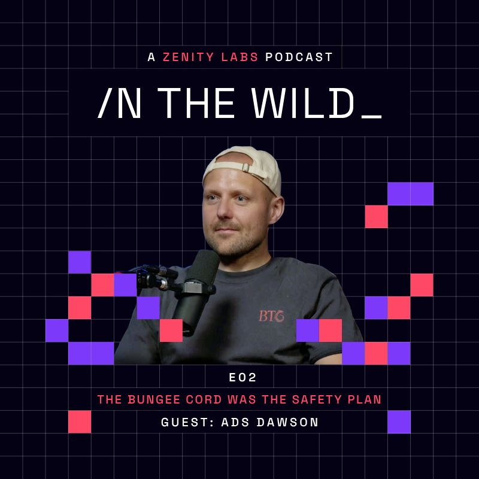
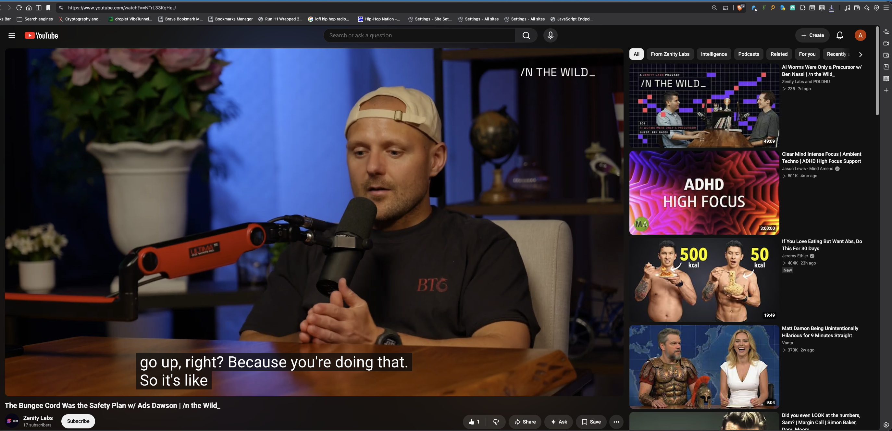
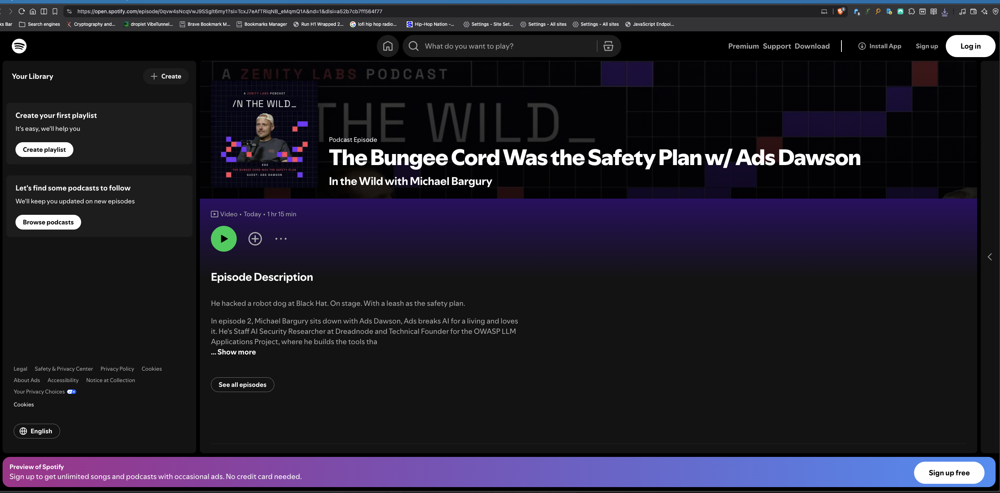

# [In the Wild — A Zenity Labs Podcast](https://www.youtube.com/@ZenityLabs)

## Ep. 2: The Bungee Cord Was the Safety Plan w/ Ads Dawson | [Episode Link](https://youtu.be/NTrL33KqHeU)

- **Episode:** In the Wild Ep. 2 — The Bungee Cord Was the Safety Plan w/ Ads Dawson
- **Date:** August 2026
- **Abstract:**

  He hacked a robot dog at Black Hat. On stage. With a leash as the safety plan. In episode 2, Michael Bargury sits down with Ads Dawson, who breaks AI for a living and loves it. He's Staff AI Security Researcher at Dreadnode and Technical Founder for the OWASP LLM Application Cybersecurity Project, where he builds the tools the industry uses to measure AI risk.

- 🎬 **YouTube** [The Bungee Cord Was the Safety Plan w/ Ads Dawson | In the Wild](https://youtu.be/NTrL33KqHeU)
- 🎧 **Spotify** [In the Wild Ep. 2](https://open.spotify.com/episode/0qvw4sNcqVwJ9SSglt6my1?si=TcxJ7eAfTRiqNB_eMqmQ1A)
- 🍎 **Apple Podcasts** [The Bungee Cord Was the Safety Plan w/ Ads Dawson](https://podcasts.apple.com/us/podcast/the-bungee-cord-was-the-safety-plan-w-ads-dawson/id6799913578?i=1000783814231)
- 🗣️ **LinkedIn** [In the Wild Ep. 2](https://www.linkedin.com/posts/inthewild-zenitylabs-share-7495102175879139328-68ru/?utm_source=social_share_send&utm_medium=member_desktop_web&rcm=ACoAAEK2uYsBq3e7WoKE4rxsA_Wwkp5qXAgnSQQ)
- 🎵 **Audio Backup (MP3)** [in-the-wild-ep2-ads-dawson.mp3](in-the-wild-ep2-ads-dawson.mp3)
- 🌐 **YouTube (HTML)** [in-the-wild-ep2-youtube.html](in-the-wild-ep2-youtube.html)
- 🌐 **Spotify (HTML)** [in-the-wild-ep2-spotify.html](in-the-wild-ep2-spotify.html)

----------------------------------------
