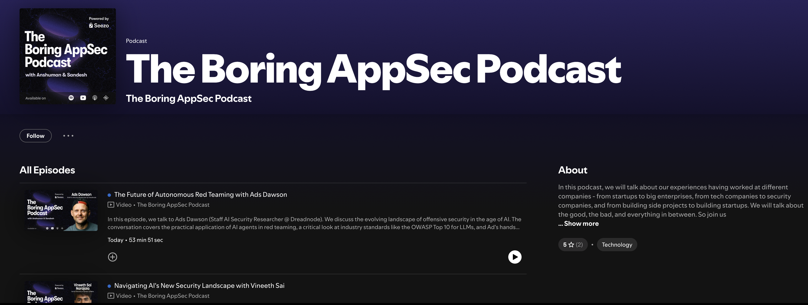
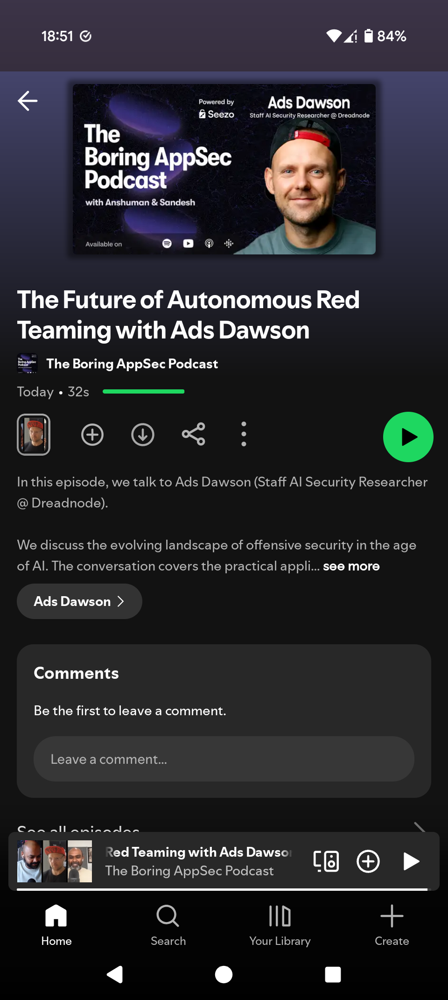
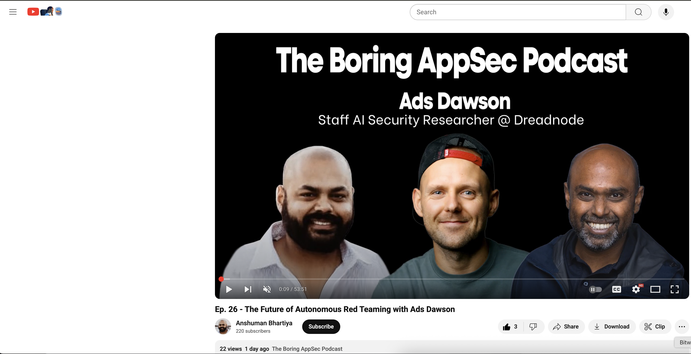

# [The Boring AppSec Podcast](https://open.spotify.com/show/podcast-show-url)
## The Future of Autonomous Red Teaming with Ads Dawson | [Episode Link](https://open.spotify.com/episode/1GHef4viw4wdeEQHQy8MhQ?si=kp5i28N3RDaZVoj8EO3ioA&nd=1&dlsi=21f0c2bed04a4b6b)

- **Episode:** The Future of Autonomous Red Teaming with Ads Dawson
- **Date:** August 2025
- **Abstract:**

   We discuss the evolving landscape of offensive security in the age of AI. The conversation covers the practical application of AI agents in red teaming, a critical look at industry standards like the OWASP Top 10 for LLMs, and Ad's hands-on approach to building and evaluating autonomous hacking tools. He shares insights from his work industrializing offensive security with AI, his journey as a self-taught professional, and offers advice for others looking to grow in the field.

   Key Takeaways

   - AI is a "Force Multiplier," Not a Replacement: Ad emphasizes that AI should be viewed as a productivity tool that enhances the capabilities of human security professionals, allowing them to scale their efforts and tackle more    complex tasks. Human expertise remains critical, especially since much of the data used to train AI models originates from human researchers.

   - Prompt Injection is a Mechanism, Not a Vulnerability: A key insight is that "prompt injection" itself isn't a vulnerability but a method used to deliver an exploit. The discussion highlights a broader critique of security  frameworks like the OWASP Top 10, which can sometimes oversimplify complex issues and become compliance checklists rather than practical guides.

   - Build Offensive Agents with Small, Focused Tasks: When creating offensive AI agents, the most successful approach is to break down the overall objective into small, concise sub-tasks. For example, instead of a single goal to "find XSS," an agent would have separate tasks to log in, identify input fields, and then test those inputs.

   - Hands-On Learning and Community are Crucial for Growth: As a self-taught professional, Ad advocates for getting deeply involved in the security community through meetups and CTFs. He stresses the importance of hands-on  practice—"just play with it"—and curating your information feed by following trusted researchers to cut through the noise and continuously learn.

   Ads shares insights from his work on the OWASP Top 10 for LLM Applications, his experience as a BugCrowd Hacker Advisory Board Member, and lessons learned from years of breaking applications and teaching others to do the same   responsibly._

- 🎧 **Spotify Episode (Listen)** [The Boring AppSec Podcast - AI Security Deep Dive](https://open.spotify.com/episode/1GHef4viw4wdeEQHQy8MhQ?si=kp5i28N3RDaZVoj8EO3ioA&nd=1&dlsi=21f0c2bed04a4b6b)
- 📣 **Podcast Show** [The Boring AppSec Podcast](https://open.spotify.com/show/5pMjAm8KJJeAcBfatcv8sZ)
- 🗞️ **Social Post** [LinkedIn](https://www.linkedin.com/feed/update/urn:li:activity:7368975592014200832/)
- 🍿 **Watch on YouTube** [The Boring AppSec Podcast - AI Security Deep Dive](https://www.youtube.com/watch?v=1Qkm9jPw4g8)

----------------------------------------