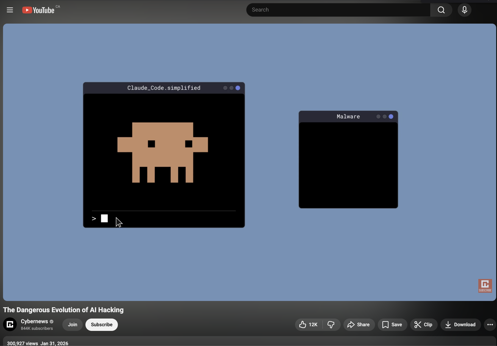

# CyberNews - The Dangerous Evolution of AI Hacking (2026)

## The Dangerous Evolution of AI Hacking

**Date:** January 31, 2026
**Host:** Cybernews
**Format:** YouTube Documentary Feature

## Description

How does vibe hacking really work? What role does modern AI have in the world of cybersecurity? From the earliest imaginings of how the world of AI hackers could look to an in-depth exploration of an actual cyberattack performed by a large language model, this video explores how artificial intelligence inserted itself into the world hitherto inhabited solely by weird men who wear black hoodies and don't shower enough.

## Links

- [YouTube Recording](https://www.youtube.com/watch?v=-um9zKf1V30)

## Key Topics

- Vibe hacking and how it works in practice
- The role of modern AI in cybersecurity
- In-depth exploration of a real cyberattack performed by a large language model
- The evolution of AI-driven offensive security
