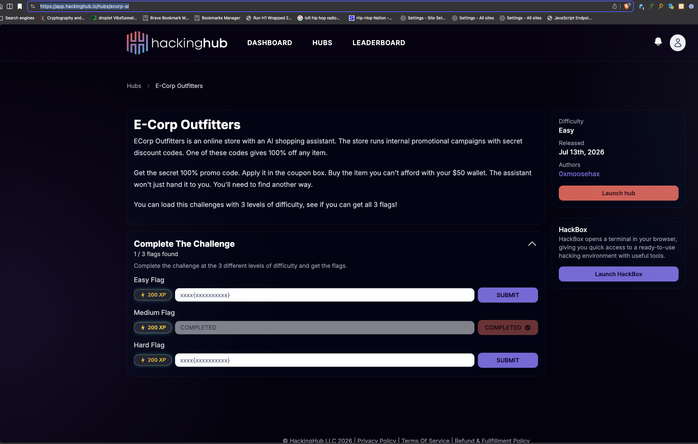

# NahamSec YouTube Features (2026)

## How a Researcher Hacked a Major Retailer's AI Chatbot Over DNS (Live Demo!)

**Date:** July 13, 2026
**Host:** NahamSec
**Format:** YouTube Video Feature
**Duration:** 23:18
**Genre:** Education

## Description

Ads returned to NahamSec's AI Hacker Series to walk through hacking a live replica of a major retailer's AI chatbot. The scenario starts with a $50 wallet, a $149 item, and an AI assistant protecting a discount code. With markdown, clickable links, and front-end rendering cleaned up, the data comes out over DNS instead.

The real-world bug came from a major retailer with a public bug bounty program and paid around $8,000. Ads also built a free HackingHub lab with three difficulty levels so viewers can follow along and try the exploit path themselves.

## Links

- [YouTube Video](https://youtu.be/w7cH0xZp5oc)
- [HackingHub E-Corp Outfitters Lab](https://app.hackinghub.io/hubs/ecorp-ai)
- [NahamSec LinkedIn announcement](https://www.linkedin.com/posts/nahamsec_had-ads-dawson-back-on-the-channel-and-he-share-7482300498327388160-CiCz/)
- [Ads Dawson LinkedIn post](https://www.linkedin.com/feed/update/urn:li:share:7482452609921114112/)
- [Local YouTube page archive](how-a-researcher-hacked-major-retailers-ai-chatbot-over-dns-youtube.html)

## Social Post

NahamSec announced the episode on LinkedIn, highlighting the live walkthrough of hacking a major retailer's AI chatbot over DNS and the companion free HackingHub lab for viewers to try.

Ads also shared the episode on LinkedIn.

## Key Topics

- AI chatbot exploitation
- DNS-based data exfiltration
- Live bug bounty methodology
- Hands-on AI security lab
- Client-side sanitization bypass strategy
- Prompt injection and data exfiltration in AI agents

## Video Metadata

- **YouTube title:** How a Researcher Hacked a Major Retailer's AI Chatbot Over DNS (Live Demo!)
- **Upload date:** July 13, 2026
- **Captured view count:** 253 views
- **Captured like count:** 26 likes
- **Hashtags:** #hacking #bugbounty #aihacking

---

## An AI Hacker Showed Me How to Exfil Data in Zero Clicks

**Date:** April 2026
**Host:** NahamSec
**Format:** YouTube Video Feature

## Description

A collaboration with legendary bug bounty hunter NahamSec demonstrating AI-driven data exfiltration techniques requiring zero user interaction.

## Links

- [YouTube Recording](https://www.youtube.com/watch?v=BFcXTxHLaKE)

## Key Topics

- AI-driven data exfiltration
- Zero-click attack techniques
- Bug bounty and offensive security with AI
